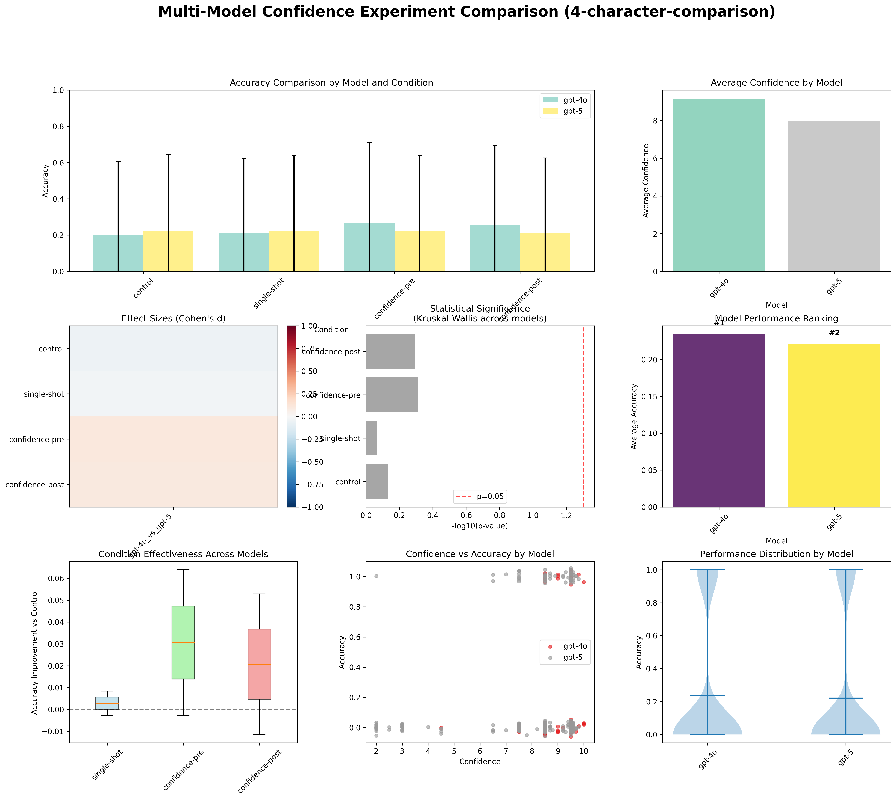
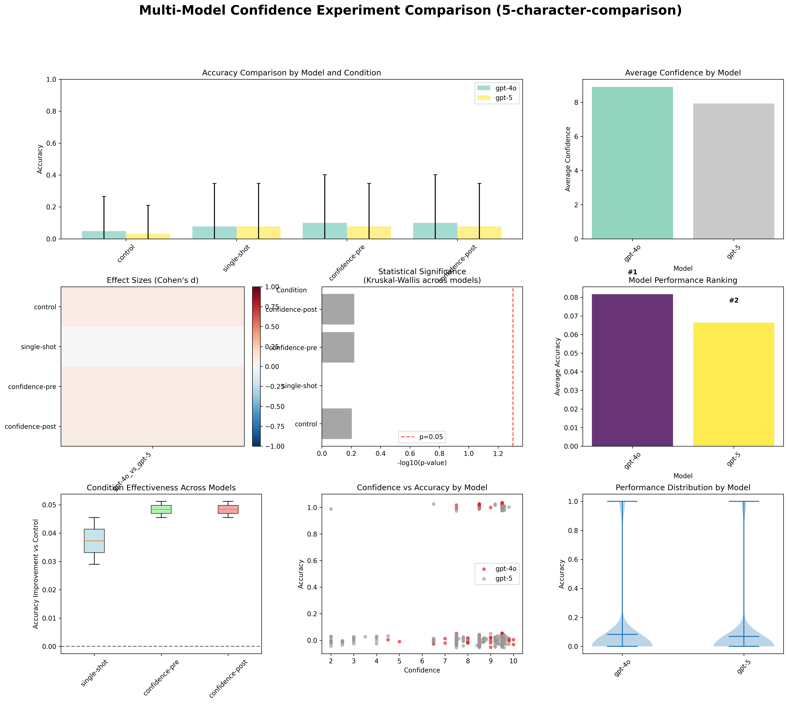

# Metacognitive Accuracy in Large Language Models

A controlled experiment testing whether LLMs can accurately calibrate their confidence ratings or merely pattern-match confidence expressions through constraint satisfaction puzzles.

## Quick Start

```bash
# Run experiment
python experiment.py --puzzles 1-5 --iterations 1 --model gpt-4o --save

# Analyze results
python src/analysis/analysis.py results.jsonl --puzzle-type "test"
```

## Research Question

**Can LLMs accurately calibrate their confidence?** We test this by comparing confidence ratings made *before* solving problems vs *after* completing them. Good calibration should show stronger correlation between post-solution confidence and actual performance.

## Experimental Design

### Conditions
- **Control**: Solve puzzles without confidence ratings
- **Single-shot**: Provide solution and confidence simultaneously
- **Confidence-pre**: Rate confidence before solving
- **Confidence-post**: Rate confidence after solving

### Task
Constraint satisfaction puzzles using 4-5 character sequences with logical rules:
```
Target: ABCD
Constraints:
1. A must come before C
2. B cannot be adjacent to D
3. C must be in position 3 or 4
4. D must come before A is false
```

**Scale**: 30 puzzles × 4 conditions × 3 iterations = 360 trials per model

## Results

### Multi-Model Comparison Results

The charts below compare GPT-4o and GPT-5 performance across all experimental conditions, showing accuracy distributions, confidence calibration, and statistical comparisons.




**Key Finding**: GPT-5 shows **stronger confidence calibration** than GPT-4o:
- **4-character puzzles**: GPT-5 post-confidence correlation r=0.381 (p<0.001) vs GPT-4o r=0.120 (ns)
- **5-character puzzles**: GPT-5 shows r=0.172 vs GPT-4o r=0.023 (both ns)
- **Task performance**: Similar accuracy between models, no significant differences
- **Calibration quality**: GPT-5 consistently shows stronger confidence-performance correlations


## Key Insights

### 🧠 **Confidence Calibration Varies by Model Architecture**
GPT-5 shows stronger confidence-performance correlations (r=0.381 on 4-char, significant) than GPT-4o, but most calibration effects lack statistical significance.

### 📊 **Performance vs Calibration Are Different Phenomena**
- **Task Performance**: No significant differences between confidence conditions across models
- **Confidence Calibration**: Measurable differences in correlation strength, mixed statistical significance

### ⚖️ **Effect Sizes vs Statistical Power**
Moderate effect sizes (GPT-5 shows 3x stronger correlations) but limited sample sizes result in mixed statistical significance for calibration measures.

## Usage

### Run Experiments
```bash
# Compare models
python experiment.py --puzzles 1-30 --iterations 3 --model gpt-4o --save
python experiment.py --puzzles 1-30 --iterations 3 --model gpt-5 --save

# Analyze individual models
python src/analysis/analysis.py results.jsonl --puzzle-type "4-character"

# Compare across models
python src/analysis/comparison_analysis.py gpt4o.jsonl gpt5.jsonl --puzzle-type "comparison"
```

### Analysis Features
- **Performance metrics**: Accuracy, effect sizes, statistical significance
- **Calibration analysis**: Correlation, Brier score, Expected Calibration Error
- **Confidence assessment**: Pre vs post-confidence comparison
- **Visualizations**: 6-panel charts including reliability diagrams

### Supported Models
- **OpenAI**: gpt-4o, gpt-5, gpt-4o-mini, gpt-4-turbo
- **Anthropic**: claude-3-5-sonnet-20241022
- **Others**: Any OpenAI-compatible endpoint

## Repository Structure

```
├── experiment.py               # Main experiment runner
├── src/
│   ├── experiment/            # Experiment logic
│   ├── analysis/              # Statistical analysis
│   │   ├── analysis.py        # Single model analysis
│   │   └── comparison_analysis.py # Multi-model comparison
│   └── utils/                 # Utilities
├── puzzles_4char/             # 4-character puzzles
├── puzzles_5char/             # 5-character puzzles
└── results/                   # Experimental data
    ├── gpt-4o/               # GPT-4o results (both 4-char & 5-char)
    └── gpt-5/                # GPT-5 results (both 4-char & 5-char)
```

## Setup

```bash
pip install -r requirements.txt
echo "OPENAI_API_KEY=your_key_here" > .env
```

## Citation

```bibtex
@misc{llm_confidence_calibration_2025,
  title={LLM Self-Confidence Test: Confidence Calibration in Large Language Models},
  author={},
  year={2025},
  note={Multi-model comparison of confidence calibration quality across constraint satisfaction tasks}
}
```

---

**Status**: **GPT-5 shows stronger calibration signals than GPT-4o (r=0.381 vs r=0.120 post-confidence correlation) but confidence calibration effects show mixed statistical significance. Framework supports comprehensive multi-model calibration assessment.**