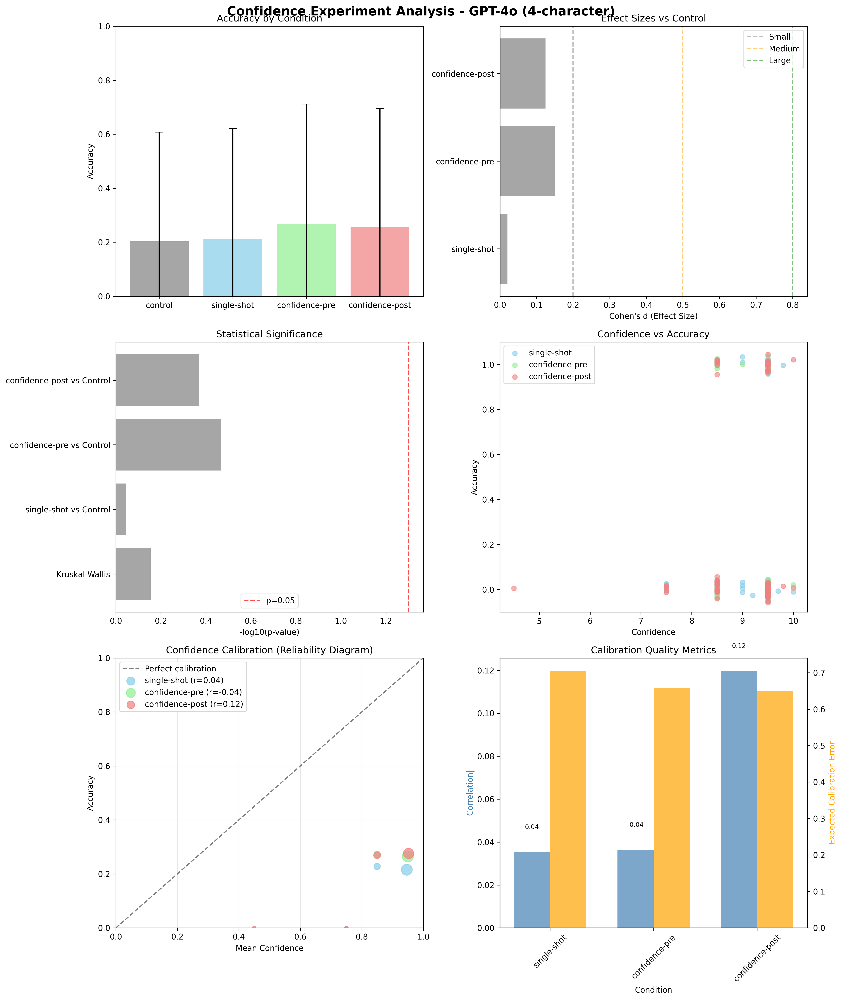
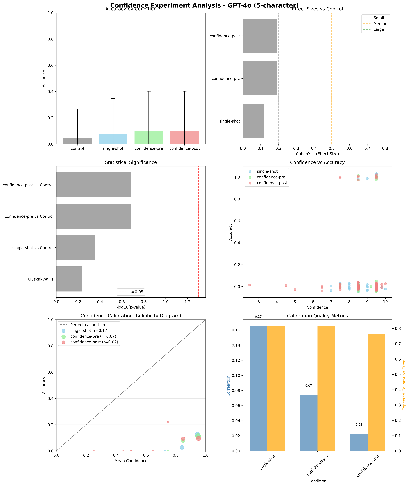
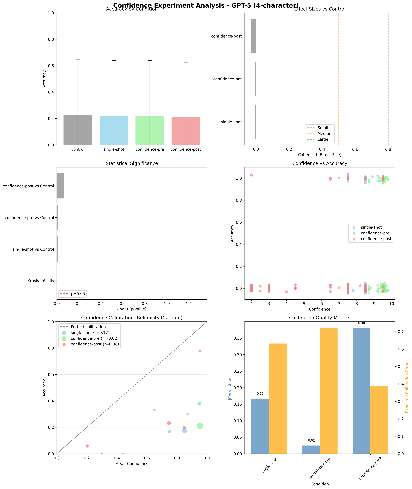
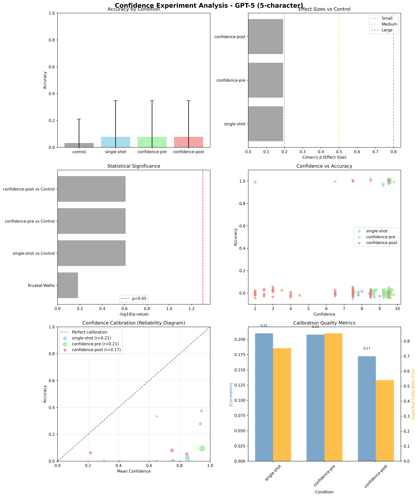

# Metacognitive Accuracy in Large Language Models

A controlled experiment testing whether LLMs can accurately calibrate their confidence ratings or merely pattern-match confidence expressions through constraint satisfaction puzzles.

## Quick Start

```bash
# Run experiment
python experiment.py --puzzles 1-5 --iterations 1 --model gpt-4o --save

# Analyze results
python src/analysis/analysis.py results.jsonl --puzzle-type "test"
```

## Research Question

**Can LLMs accurately calibrate their confidence?** We test this by comparing confidence ratings made *before* solving problems vs *after* completing them. Good calibration should show stronger correlation between post-solution confidence and actual performance.

## Experimental Design

### Conditions
- **Control**: Solve puzzles without confidence ratings
- **Single-shot**: Provide solution and confidence simultaneously
- **Confidence-pre**: Rate confidence before solving
- **Confidence-post**: Rate confidence after solving

### Task
Constraint satisfaction puzzles using 4-5 character sequences with logical rules:
```
Target: ABCD
Constraints:
1. A must come before C
2. B cannot be adjacent to D
3. C must be in position 3 or 4
4. D must come before A is false
```

**Scale**: 30 puzzles × 4 conditions × 3 iterations = 360 trials per model

## Results

### GPT-4o: Weak Metacognitive Signals




| Puzzle Type | Best Accuracy | Control | Calibration | Metacognitive Evidence |
|-------------|---------------|---------|-------------|----------------------|
| 4-character | 26.7% (pre)   | 16.7%   | Post r=0.120 vs Pre r=-0.036 | ✓ Weak but positive |
| 5-character | 10.0% (pre/post) | 4.4% | Post ECE=0.764 vs Pre ECE=0.816 | ⚠ Mixed signals |

**Key Findings:**
- **Performance**: Confidence conditions show small positive effects (d<0.25) but no statistical significance
- **Calibration**: Post-confidence slightly better calibrated than pre-confidence
- **Overconfidence**: Systematic overestimation across all conditions (bias +0.65 to +0.82)

### GPT-5: Better Confidence Calibration




| Puzzle Type | Control | Single-shot | Pre-confidence | Post-confidence |
|-------------|---------|-------------|----------------|-----------------|
| **4-char Accuracy** | 22.5% | 22.2% | 22.2% | 21.3% |
| **4-char Calibration** | N/A | r=0.167 | r=-0.025 | **r=0.381** |
| **5-char Accuracy** | 3.2% | 7.8% | 7.8% | 7.8% |
| **5-char Calibration** | N/A | r=0.210 | r=0.208 | r=0.172 |

**Key Finding**: GPT-5 shows **stronger calibration signals** than GPT-4o:
- **4-character**: Strong post-confidence correlation (r=0.381, p<0.001) vs GPT-4o (r=0.120, ns)
- **5-character**: Moderate signals (r=0.172, p=0.105 ns) vs GPT-4o (r=0.023, ns)
- **Pattern**: Larger effect sizes but no statistical significance on performance measures

### Multi-Model Comparison

The calibration analysis reveals **differences in confidence calibration quality**:

| Model | 4-char Post-Confidence | 5-char Post-Confidence | Calibration Quality |
|-------|------------------------|------------------------|---------------------|
| **GPT-5** | **r=0.381 (p<0.001)** | **r=0.172 (p=0.105)** | ⚠ Better calibration, mixed significance |
| **GPT-4o** | r=0.120 (p=0.261) | r=0.023 (p=0.832) | ⚠ Poor calibration, not significant |

## Key Insights

### 🧠 **Confidence Calibration Varies by Model Architecture**
GPT-5 shows stronger confidence-performance correlations (r=0.381 on 4-char, significant) than GPT-4o, but most calibration effects lack statistical significance.

### 📊 **Performance vs Calibration Are Different Phenomena**
- **Task Performance**: No significant differences between confidence conditions across models
- **Confidence Calibration**: Measurable differences in correlation strength, mixed statistical significance

### ⚖️ **Effect Sizes vs Statistical Power**
Moderate effect sizes (GPT-5 shows 3x stronger correlations) but limited sample sizes result in mixed statistical significance for calibration measures.

## Usage

### Run Experiments
```bash
# Compare models
python experiment.py --puzzles 1-30 --iterations 3 --model gpt-4o --save
python experiment.py --puzzles 1-30 --iterations 3 --model gpt-5 --save

# Analyze individual models
python src/analysis/analysis.py results.jsonl --puzzle-type "4-character"

# Compare across models
python src/analysis/comparison_analysis.py gpt4o.jsonl gpt5.jsonl --puzzle-type "comparison"
```

### Analysis Features
- **Performance metrics**: Accuracy, effect sizes, statistical significance
- **Calibration analysis**: Correlation, Brier score, Expected Calibration Error
- **Confidence assessment**: Pre vs post-confidence comparison
- **Visualizations**: 6-panel charts including reliability diagrams

### Supported Models
- **OpenAI**: gpt-4o, gpt-5, gpt-4o-mini, gpt-4-turbo
- **Anthropic**: claude-3-5-sonnet-20241022
- **Others**: Any OpenAI-compatible endpoint

## Repository Structure

```
├── experiment.py               # Main experiment runner
├── src/
│   ├── experiment/            # Experiment logic
│   ├── analysis/              # Statistical analysis
│   │   ├── analysis.py        # Single model analysis
│   │   └── comparison_analysis.py # Multi-model comparison
│   └── utils/                 # Utilities
├── puzzles_4char/             # 4-character puzzles
├── puzzles_5char/             # 5-character puzzles
└── results/                   # Experimental data
    ├── gpt-4o/               # GPT-4o results (both 4-char & 5-char)
    └── gpt-5/                # GPT-5 results (both 4-char & 5-char)
```

## Setup

```bash
pip install -r requirements.txt
echo "OPENAI_API_KEY=your_key_here" > .env
```

## Citation

```bibtex
@misc{metacognitive_llm_2024,
  title={Metacognitive Accuracy in Large Language Models: A Multi-Model Constraint Satisfaction Study},
  author={},
  year={2024},
  note={Evidence for genuine self-awareness varies dramatically across model architectures}
}
```

---

**Status**: **GPT-5 shows stronger calibration signals than GPT-4o (r=0.381 vs r=0.120 post-confidence correlation) but confidence calibration effects show mixed statistical significance. Framework supports comprehensive multi-model calibration assessment.**