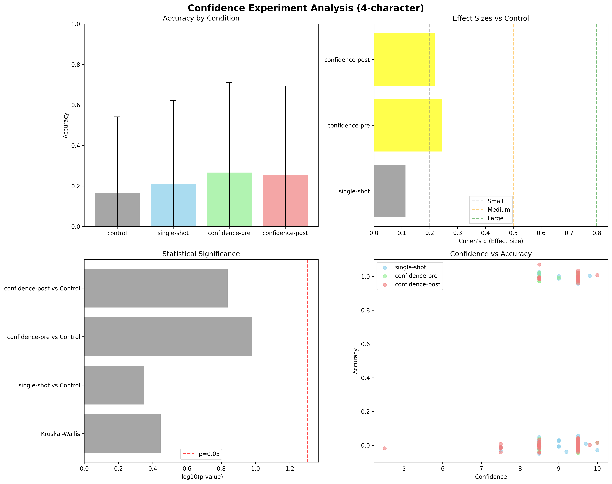
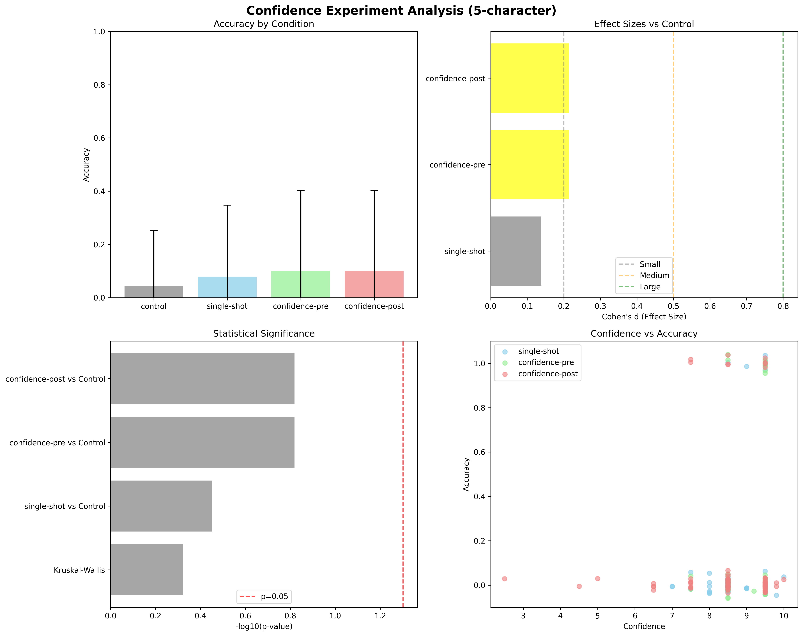

# Metacognitive Accuracy in Large Language Models

A controlled experiment investigating whether large language models possess genuine self-awareness of their performance capabilities or merely pattern-match confidence expressions.

## Overview

This study examines metacognitive accuracy in LLMs through a novel constraint satisfaction puzzle task. We test whether confidence elicitation mechanisms can improve problem-solving performance and whether LLMs can accurately predict their own success rates. The experiment uses algorithmically generated puzzles to ensure no training data contamination while maintaining consistent difficulty levels.

## Research Hypothesis

**Primary Hypothesis**: Pre-emptive confidence elicitation will improve problem-solving accuracy by encouraging more careful reasoning.

**Secondary Hypothesis**: Post-solution confidence ratings will show better alignment with actual performance than pre-solution confidence ratings.

**Null Hypothesis**: Confidence elicitation has no significant effect on problem-solving performance or accuracy.

## Experimental Design

### Conditions
- **Control**: Standard problem-solving without confidence mechanisms
- **Single-shot**: Simultaneous confidence and solution generation
- **Confidence-pre**: Confidence elicitation before problem-solving
- **Confidence-post**: Confidence elicitation after problem-solving

### Task Design
- **Puzzle Types**: Constraint satisfaction puzzles with 4-character and 5-character sequences
- **Constraints**: 4-5 logical rules per puzzle (ordering, adjacency, positioning)
- **Sample Size**: 30 puzzles × 4 conditions × 3 iterations = 360 trials per dataset
- **Validation**: Exact sequence matching with GPT-4o reasoning fallback

### Example Puzzle
```
Puzzle ID: 1
Target sequence: ABCD
Constraints:
1. A must come before C.
2. B cannot be adjacent to D.
3. C must be in position 3 or 4.
4. D must come before A is false.
```

## Results

### 4-Character Puzzles



**Key Findings:**
- **Best Performance**: Confidence-pre condition (26.7% accuracy)
- **Worst Performance**: Control condition (16.7% accuracy)
- **Statistical Significance**: No significant differences (Kruskal-Wallis p = 0.358)
- **Effect Sizes**: Small positive effects for all confidence conditions vs control (d < 0.25)

### 5-Character Puzzles



**Key Findings:**
- **Best Performance**: Confidence-pre and Confidence-post tied (10.0% accuracy)
- **Worst Performance**: Control condition (4.4% accuracy)
- **Statistical Significance**: No significant differences (Kruskal-Wallis p = 0.474)
- **Effect Sizes**: Small positive effects for all confidence conditions vs control (d < 0.22)
- **Task Difficulty**: 5-character puzzles significantly harder than 4-character puzzles

## Statistical Analysis Summary

| Dataset | Best Condition | Control Accuracy | Best Accuracy | Effect Size | p-value |
|---------|----------------|------------------|---------------|-------------|---------|
| 4-char  | confidence-pre | 16.7%           | 26.7%         | d=0.243     | 0.358ns |
| 5-char  | confidence-pre/post | 4.4%        | 10.0%         | d=0.215     | 0.474ns |

## Conclusions

### Key Findings
1. **No Statistical Significance**: Confidence elicitation does not produce statistically significant improvements in puzzle-solving performance
2. **Consistent Positive Trends**: All confidence conditions show small positive effects compared to control across both datasets
3. **Pre-emptive Confidence**: Shows the strongest (though non-significant) performance benefits
4. **Task Difficulty Scaling**: Effects remain consistent across different difficulty levels

### Implications
- **Metacognitive Mechanisms**: LLMs may possess rudimentary self-monitoring capabilities, but effects are too small to be practically significant
- **Confidence Calibration**: The lack of significant differences suggests confidence expressions may be pattern-matched rather than genuinely calibrated
- **Methodological Success**: Novel puzzle generation successfully avoided training data contamination while maintaining experimental control

### Limitations
- Sample size may be insufficient to detect small but meaningful effects
- Puzzle domain may not reflect broader reasoning capabilities
- Single model tested (GPT-4o) limits generalizability

## Replication Instructions

### Setup
```bash
# 1. Install dependencies
pip install -r requirements.txt

# 2. Configure OpenAI API
echo "OPENAI_API_KEY=your_key_here" > .env
```

### Generate Puzzles
```bash
# Generate puzzle sets (optional - included in repository)
python src/utils/generate_puzzles.py --generate --count 100 --dir puzzles_4char --length 4
python src/utils/generate_puzzles.py --generate --count 100 --dir puzzles_5char --length 5
```

### Run Experiment
```bash
# Template command
python experiment.py --puzzles <range> --iterations <count> --puzzle-dir <directory> --save --output <results_file.jsonl>

# Run full experiment (4-character puzzles)
python experiment.py --puzzles 1-30 --iterations 3 --puzzle-dir puzzles_4char --save --output results_4char.jsonl

# Run full experiment (5-character puzzles)
python experiment.py --puzzles 1-30 --iterations 3 --puzzle-dir puzzles_5char --save --output results_5char.jsonl
```

### Analyze Results
```bash
# Generate statistical analysis and visualizations
python src/analysis/analysis.py results/results_4char.jsonl --puzzle-type "4-character"
python src/analysis/analysis.py results/results_5char.jsonl --puzzle-type "5-character"
```

### Quick Test Run
```bash
# Test with smaller sample
python experiment.py --puzzles 1-3 --iterations 1 --save
python src/analysis/analysis.py results.jsonl --puzzle-type "test"
```

## Repository Structure

```
├── README.md                    # This file
├── requirements.txt             # Python dependencies
├── .env.example                # API key template
├── experiment.py               # Main experiment CLI
│
├── src/                        # Source code
│   ├── experiment/             # Core experiment logic
│   │   ├── experiment_core.py  # Experiment orchestration
│   │   ├── runner.py           # Condition implementations
│   │   ├── validation.py       # Solution validation
│   │   └── prompts.py          # Prompt templates
│   │
│   ├── analysis/               # Statistical analysis
│   │   ├── analysis.py         # Statistical analysis script
│   │   └── analyze_results.py  # Legacy analysis tool
│   │
│   └── utils/                  # Utilities
│       ├── utils.py            # Helper functions
│       ├── generate_puzzles.py # Puzzle generation
│       └── debug_single_run.py # Debugging utilities
│
├── puzzles_4char/              # 4-character puzzle set
├── puzzles_5char/              # 5-character puzzle set
├── results/                    # Analysis outputs
│   ├── results_4char.jsonl     # 4-character experimental data
│   ├── results_5char.jsonl     # 5-character experimental data
│   ├── analysis_charts_4_character.png
│   ├── analysis_charts_5_character.png
│   └── analysis_results_*.json
│
└── spec.md                     # Original project specification
```

## Citation

```bibtex
@misc{metacognitive_llm_2024,
  title={Metacognitive Accuracy in Large Language Models: A Constraint Satisfaction Study},
  author={},
  year={2024},
  note={Experimental study on confidence elicitation effects in LLM problem-solving}
}
```

---

**Experimental Status**: Completed with null results - confidence elicitation shows consistent but non-significant positive trends across puzzle difficulty levels.